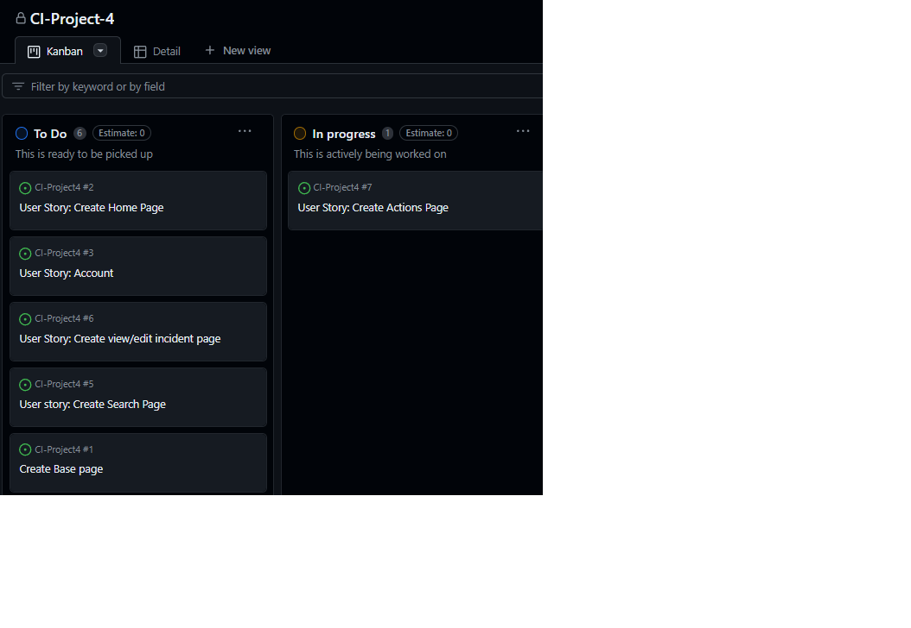
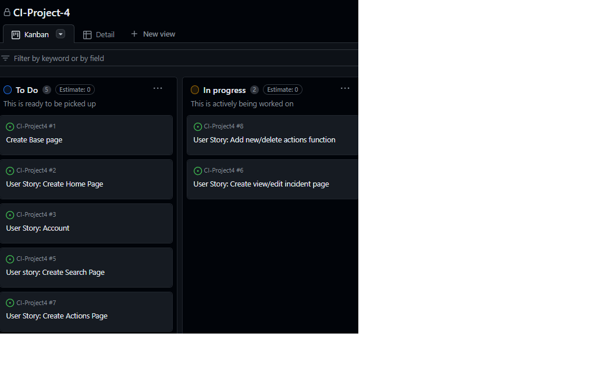

# Artic Case Manager

Image of site different sizes

Artic Case Manager is a website designed to support Public Protection workers in local government to manage their cases.

Visit the deployed website [here](https://project-4-artic-case-manager-0cfe222fc6e4.herokuapp.com/)

## Table of Contents

1. [User Experience](#user-experience)
2. [Features](#features)
3. [Technologies Used](#technologies-used)
4. [Testing](#testing)
    1. [Automated](#automated)
    2. [Manual](#manual)
5. [Deployment](#deployment)
6. [Product](#product)
7. [Credits](#credits)

## User Experience

### User Stories & Project

**Stage 1**

**Stage 2**

**Stage 3**

**Stage 4**

**Stage 5**

**Stage 6**

**Stage 7**

**Stage 8**

**Stage 9**

**Stage 10**

**Stage 11**

**Stage 12**

**Stage 13**

**Stage 14**

**Stage 15**

## Features

## Technologies Used

### Languages Used
* HTML
* CSS
* JavaScript
* Python

### Frameworks, Libraries and Packages
* Django
* allauth
* Crispy Form
* Bootstrap 5
* Font Awesome
* Cloudinary
* Gunicorn

### Other
* ElephantSQL
* Heroku
* favicon.io

## Testing

### Automated

### Manual

## Deployment
This project was developed using Visual Studio Code

### Deployment via Heroku
To deploy this repository via Heroku follow the below steps

1. Clone this repository
2. Sign into Heroku
    1. Select 'Create new app'
    2. Give a name to the app and select a location
3. Create a ElephantSQL postgres database (ensure its postgres 13 or higher)
4. Create a Cloudinary account
5. Set up Config Vars
    1. Go to the settings in your app
    2. scroll to Config Vars and select Reveal Config Vars
    3. Add CLOUDINARY_URL as key and then your URL provided by Cloudunary as the value
    4. Add DATABASE_URL as key and then your URL provided by ElephantSQL key as the value
    5. Add SECRET_KEY as key and then your secret key as the value
6. Deploying
    1. Go to the Deploy tab and select your cloned repository for deployment
    2. Scroll down to the bottom and deploy from the main branch

## Product

Page | Laptop | Mobile |
--- | --- | --- |
| Home | - | - |
| Incidents | - | - |
| Incident | - | - |
| Actions | - | - |
| Action | - | - |
| Photos | - | - |
| Sign-up | - | - |
| Login | - | - |
| Logout | - | - |

## Credits
* Pop-up messages was taken from [Code Institute's](https://codeinstitute.net/) django-blog project.
